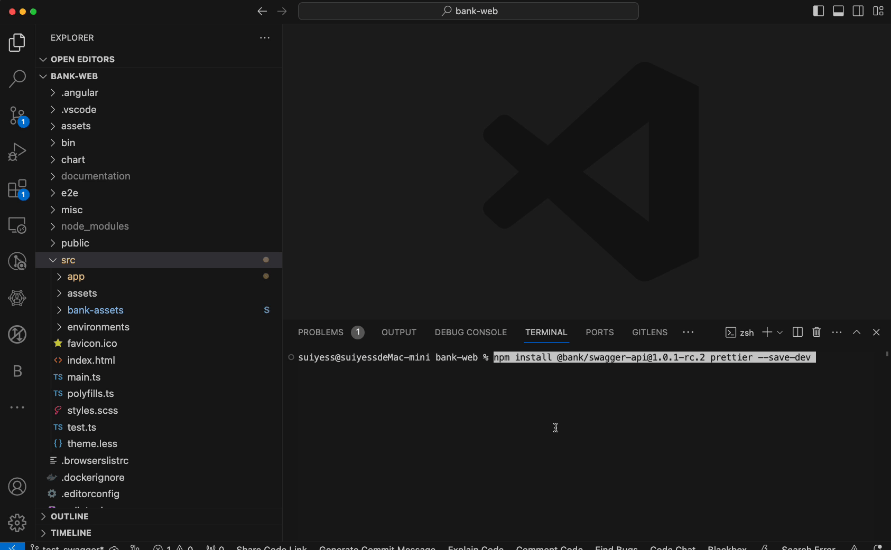

1. 安装npm包：
   

```bash
   npm install @bank/swagger-api@1.0.3 prettier --save-dev
```



2. 将 `.swagger-api.config.json` 复制粘贴到项目根目录下
  > 执行后发现后端会重复定义，相关属性会丢失，故将edc/platform等接口后执行
  > 重复定义示例 `RealData.Entity.Contract.Enums.CRFItemType`，在edcmodel内有完整枚举定义，在dsr里只剩下了枚举的值，完整枚举定义更适合前端使用

```json
    {
  "outputDir": "__generated__",
  "schemasKey": "schemas",
  "apiJsons": [
    {
      "name": "ir",
      "path": "http://bank-web-4560-develop.sy/api/ir/swagger/ir/swagger.json",
      "network": "IRNetworkService"
    },
    {
      "name": "search",
      "path": "http://bank-web-4560-develop.sy/api/search/swagger/search/swagger.json",
      "network": "SearchNetworkService"
    },
    {
      "name": "stat",
      "path": "http://bank-web-4560-develop.sy/api/stat/swagger/stat/swagger.json",
      "network": "StatNetworkService"
    },
    {
      "name": "dsr",
      "path": "http://bank-web-4560-develop.sy/api/dsr/swagger/v1/swagger.json",
      "network": "DiseaseResearchNetworkService"
    },
    {
      "name": "collection",
      "path": "http://bank-web-4560-develop.sy/api/collection/swagger/collection/swagger.json",
      "network": "CollectionNetworkService"
    },
    {
      "name": "platform",
      "path": "http://bank-web-4560-develop.sy/api/platform/swagger/v1/swagger.json",
      "network": "PlatformNetworkService"
    },
    {
      "name": "edc",
      "path": "http://bank-web-4560-develop.sy/api/edc/swagger/v1/swagger.json",
      "network": "EDCNetworkService"
    }
  ]
}
  ```


3. 更新启动脚本：
   
``` diff
  - "start": "node --max_old_space_size=8192 ./node_modules/@angular/cli/bin/ng serve --host 0.0.0.0 --port 4200",
  
  + "start": "swagger-gen; node --max_old_space_size=8192 ./node_modules/@angular/cli/bin/ng serve --host 0.0.0.0 --port 4200",
```

4. service 文件内部使用


